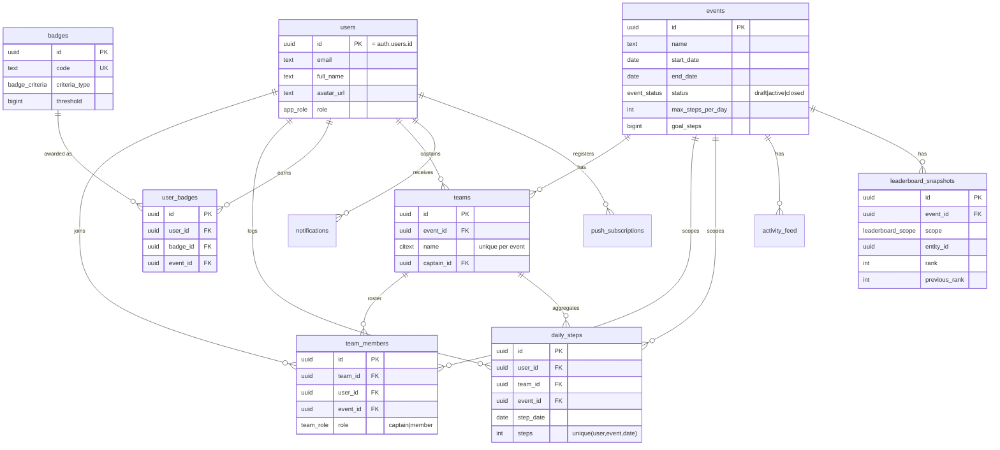
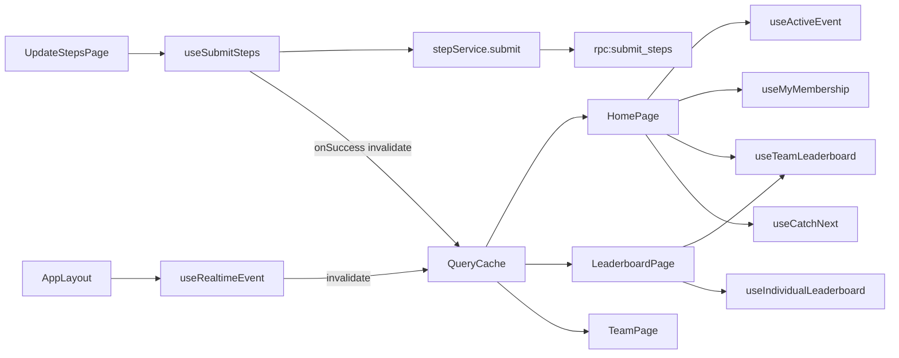

# Stepathon — Architecture & Engineering Reference

This document is the implementation reference. It follows the requested deliverable
order. Code lives in the repo; this explains the *why* and the contracts.

---

## 1. System Architecture Diagram

```mermaid
flowchart TD
  subgraph Client["📱 PWA (React + Vite, served by Vercel CDN)"]
    UI[ShadCN UI / pages]
    RQ[TanStack Query cache]
    RT[Realtime client]
    SW[Service Worker + Web Push]
  end

  subgraph Supabase["☁️ Supabase"]
    Auth[GoTrue Auth\nGoogle OAuth / PKCE]
    PG[(PostgreSQL\ntables + views + RLS)]
    RPC[RPC / SQL functions\nsubmit_steps, evaluate_badges,\ncatch_next_team, snapshots]
    REALTIME[Realtime\nlogical replication]
    EDGE[Edge Functions\nsend-push, daily-reminder]
  end

  Google[Google Identity]
  Push[Browser Push Service\nFCM / Mozilla / Apple]

  UI --> RQ -->|REST /rest/v1| PG
  UI -->|rpc /rpc| RPC --> PG
  UI --> Auth --> Google
  RT <-->|websocket| REALTIME --- PG
  RPC --> REALTIME
  EDGE --> PG
  EDGE -->|web-push| Push --> SW --> UI
  RQ <-. invalidate on change .- RT
```

**Key decisions**
- **No custom API server.** Supabase auto-generates a REST + RPC API over Postgres;
  RLS is the authorization layer. This keeps us on free tiers and removes a deploy target.
- **Writes that need validation go through SQL `SECURITY DEFINER` functions** (e.g.
  `submit_steps`), not direct table writes. The corresponding tables have *no* write
  RLS policy, so the function is the only path in — validation can't be bypassed.
- **Freshness is push-driven.** Realtime emits Postgres change events; the client
  invalidates the matching TanStack Query keys instead of polling.

---

## 2. Database ER Diagram



---

## 3–5. Database Schema · SQL Migrations · RLS

All SQL is in [`supabase/migrations`](../supabase/migrations):

| File | Contents |
|------|----------|
| `0001_schema.sql` | Enums, 11 tables, PKs/FKs, CHECK constraints, indexes, `updated_at` triggers. |
| `0002_functions_views.sql` | `handle_new_user` trigger, leaderboard views, `submit_steps`, gamification engine, `catch_next_team`, snapshot capture. |
| `0003_rls.sql` | RLS enable + policies on every table; `security_invoker` views. |
| `0004_seed_badges.sql` | Idempotent badge catalog. |

**Invariants enforced in the DB (not just the UI):**

| Rule | Mechanism |
|------|-----------|
| Only one **active** event | partial unique index `events_one_active_idx WHERE status='active'` |
| Team name unique per event | `unique(event_id, name)` on `citext` (case-insensitive) |
| One team per user per event | `unique(event_id, user_id)` on `team_members` |
| One step submission per day | `unique(user_id, event_id, step_date)` → upsert |
| No future / out-of-window / over-max steps | guards inside `submit_steps()` |
| `end_date >= start_date` | CHECK constraint |

**RLS posture:** reads are broad (a competition is visible to all signed-in members);
writes are narrow. `daily_steps`, `user_badges`, `activity_feed` have **no write
policy** — they are mutated only by `SECURITY DEFINER` functions. `notifications` and
`push_subscriptions` are strictly per-owner. Admin gating uses `is_admin()`.

---

## 6. API Design

There are three call shapes, all over the Supabase client (`src/services/*`):

**a) REST reads** (`supabase.from(...).select()`), authorized by RLS:

| Service | Reads |
|---------|-------|
| `eventService` | active event, list |
| `leaderboardService` | `v_team_leaderboard`, `v_individual_leaderboard` (+ snapshot prev-ranks for ⬆⬇➡) |
| `teamService` | teams, members (+ totals + badges), my membership |
| `badgeService` | catalog + earned → `collection()` |
| `activityService` | event/team feed |
| `notificationService` | inbox, mark read |
| `adminService` | aggregate stats, daily trend |

**b) RPC writes** (`supabase.rpc(...)`), validated server-side:

| Function | Contract |
|----------|----------|
| `submit_steps(p_step_date, p_steps) → daily_steps` | upsert + fire badges/feed; raises `NO_ACTIVE_EVENT \| NOT_ON_TEAM \| FUTURE_DATE \| OUT_OF_WINDOW \| STEPS_OUT_OF_RANGE` (mapped to friendly text in `step.service.ts`). |
| `catch_next_team(p_team_id) → {next_team_id,next_team_name,gap}` | steps to overtake the team one rank above. |
| `current_streak(p_user_id, p_event_id) → int` | consecutive logged days. |
| `capture_leaderboard_snapshot(p_event_id)` | persist ranks for movement arrows (run by cron). |

**c) Edge Functions** (HTTP, service-role):

| Function | Trigger | Job |
|----------|---------|-----|
| `send-push` | invoked | fan out a Web Push to a user's devices; prune dead endpoints. |
| `daily-reminder` | cron `0 18 * * *` | notify members who haven't logged today. |

Direct table writes are reserved for things RLS can safely own: creating events
(admin), creating/joining teams (self or captain), managing your own notifications
and push subscriptions.

---

## 7–8. Frontend Folder Structure · UI Component Architecture

Folder structure is in the [README](../README.md#repository-layout). Layering rule:

```
pages  →  hooks  →  services  →  lib/supabase  →  Supabase
(view)    (react-query state)  (data access)    (transport)
components/* are presentational; they take props, never call services directly.
```

**Component inventory**

| Category | Components |
|----------|-----------|
| `ui/` (ShadCN) | Button, Card, Tabs (+ add Avatar, Dialog, Toast, Progress, DropdownMenu via `npx shadcn add`) |
| layout | `AppLayout`, `BottomNavigation`, `ProtectedRoute` |
| common | `StatCard`, `ProgressCard`, `BadgeCard`, `ActivityCard`, `CatchNextWidget`, (NotificationCard) |
| leaderboard | `LeaderboardCard` (rank, medal, movement ⬆⬇➡, highlight self) |
| team | `TeamMemberCard` (photo, name, steps, badges, 👑 captain) |

---

## 9. Page Wireframes

```
┌─ LOGIN ─────────┐  ┌─ HOME ──────────┐  ┌─ UPDATE STEPS ──┐
│   👟  Stepathon │  │ Hi, Mary 👋  ev │  │ ← Update Steps  │
│ Walk Together.  │  │ ┌Today┐ ┌Rank ┐ │  │ Date [2026-06-16]│
│ Win Together.   │  │ │8,540│ │ 2nd │ │  │  ┌───────────┐  │
│ ┌─────────────┐ │  │ └─────┘ └─────┘ │  │  │   8500    │  │
│ │ G  Continue │ │  │ [ + Update Steps]│  │  └───────────┘  │
│ └─────────────┘ │  │ ⚡6,250 to Team A│  │ max 100,000/day │
└─────────────────┘  │ ▓▓▓▓░ 78% goal  │  │ [  Save Steps ] │
                     │ Activity feed…  │  └──────🎉 confetti─┘
                     │ [Home][🏆][👥][👤]│
                     └─────────────────┘
┌─ TEAM ──────────┐  ┌─ LEADERBOARD ───┐  ┌─ PROFILE ───────┐
│ Walking Warriors│  │ [Teams][Individ]│  │ 🧑 Mary  •••     │
│ ┌Rank┐ ┌Steps ┐ │  │ 🥇 Team A  ⬆    │  │ ┌🔥 7┐ ┌Total ┐  │
│ │ 2nd│ │412k  │ │  │ 🥈 Warriors ➡   │  │ │days│ │412k │  │
│ └────┘ └──────┘ │  │ 🥉 Team C  ⬇    │  │ Badges 🏅🥈🔥📅 │
│ ⚡catch next    │  │ 4  Team D  ✨   │  │ History 06-16…  │
│ 👑 Mary  152k🏅 │  │  …             │  │ [Enable notifs] │
│    John  131k🔥 │  │                 │  │ [Sign out]      │
└─────────────────┘  └─────────────────┘  └─────────────────┘
```

Admin dashboard adds: 6 stat tiles (participants, teams, participation %, today's
steps, top team, most active) + **Daily Step Trend** (line) and **Daily Participation**
(bar) via Recharts; extendable with Top Teams / Top Individuals / Badge Distribution.

---

## 10. React Component Breakdown (data flow)



Submission path end-to-end: form → Zod validate → `useSubmitSteps` mutation →
`submit_steps` RPC (server validation + badges + feed) → `onSuccess` invalidates
leaderboard/steps/activity/badges keys → Realtime also broadcasts the `daily_steps`
change so *other* users' caches invalidate → 🎉 confetti → redirect home.

---

## 11. State Management Strategy

- **Server state → TanStack Query.** Centralized keys in `lib/constants.ts (qk)`.
  - `staleTime: 30s` dedupes burst refetches; `gcTime: 5m` keeps tab-switches instant.
  - `refetchOnWindowFocus` + `refetchOnReconnect` for cheap recovery.
  - **Realtime is the primary freshness signal:** `useRealtimeEvent` invalidates the
    exact keys on DB change, so we avoid polling. Mutations also do targeted
    `invalidateQueries` in `onSuccess`.
- **Auth/session → React Context** (`useAuth`) — single source for session + profile + role.
- **Local UI state → component `useState`** (tab selection, form fields). Zustand is
  installed for any future cross-screen ephemeral state (e.g. a global toast queue).
- **Forms → React Hook Form + Zod** (`lib/validation.ts`) — client validation mirrors
  the server guards so users get instant feedback; the server remains the source of truth.

---

## 12. Gamification Engine Design

Badges are **data, not code** — rows in `badges` with a `criteria_type` + `threshold`.
`evaluate_badges(user, event)` runs inside `submit_steps` after every save:

| Badge | criteria_type | threshold |
|-------|---------------|-----------|
| First 10K | `single_day_threshold` | 10,000 |
| 50K/100K/250K/500K Club | `total_threshold` | 50k…500k |
| 7 / 14 Day Streak | `streak` | 7 / 14 |
| Consistency Champion | `consistency` | (every event day) |
| Top Contributor | `top_contributor` | (top 3 in team) |

Engine flow: compute totals/best-day/streak/days-logged → loop catalog, skip
already-awarded → insert `user_badges` (idempotent via unique constraint) → emit an
`activity_feed` row and an in-app `notification`. Adding a badge type = inserting a row
(+ one branch if a new criteria_type). Streaks use `current_streak()`; "Top Contributor"
is computed per-team with `dense_rank()`.

The **activity feed** is generated automatically by `log_activity()` from
`submit_steps`, `evaluate_badges`, and (optionally) rank-change detection in the
snapshot job — e.g. *"Mary submitted 14,200 steps"*, *"John earned 100K Club"*,
*"Walking Warriors moved to Rank #1"*.

---

## 13. Notification Design

Two channels:
1. **In-app inbox** — `notifications` table, per-user RLS, surfaced via a bell with a
   Realtime subscription (`useRealtimeNotifications`).
2. **Web Push** — `push_subscriptions` stores VAPID endpoints; the `send-push` Edge
   Function delivers; `daily-reminder` cron drives the "log your steps" nudge.

| Type | Source |
|------|--------|
| `daily_reminder` | `daily-reminder` cron at 18:00 for members who haven't logged |
| `achievement` | `evaluate_badges` on badge unlock |
| `ranking_change` | snapshot job comparing rank vs `previous_rank` |
| `challenge_alert` | "only N steps behind Rank #1" (from `catch_next_team`) |

Client opt-in: `notificationService.enablePush()` requests permission, subscribes via
the SW push manager, and upserts the endpoint (deduped on `endpoint`).

---

## 14. PWA Design

- **Installable** — manifest in `vite.config.ts` (name, theme `#10b981`, standalone,
  portrait, maskable icons). iOS meta tags + `apple-touch-icon` in `index.html`.
- **Service worker** — `vite-plugin-pwa` (Workbox, `autoUpdate`). Precaches the app
  shell; `NetworkFirst` runtime cache for `/rest/v1/` GETs → leaderboards/feed are
  **viewable offline** (last-known), with a 4s network timeout fallback to cache.
- **Splash/safe-area** — `pt-safe`/`pb-safe` utilities respect notch & home indicator;
  `.app-shell` constrains to a 480px phone column and centers on desktop.
- **Push display** — for click-to-open behavior, switch the plugin to
  `strategies: 'injectManifest'` with a `src/sw.ts` adding:
  ```js
  self.addEventListener('push', (e) => {
    const d = e.data?.json() ?? {};
    e.waitUntil(self.registration.showNotification(d.title, { body: d.body, data: { url: d.url } }));
  });
  self.addEventListener('notificationclick', (e) => {
    e.notification.close();
    e.waitUntil(clients.openWindow(e.notification.data?.url ?? '/'));
  });
  ```
  (The default `generateSW` config already covers install + offline; add the custom SW
  when you ship rich push.)

---

## 15. Deployment Guide

See [`docs/DEPLOYMENT.md`](DEPLOYMENT.md) — local setup, Supabase project + migrations,
Google OAuth (Cloud Console + Supabase provider), env vars, VAPID keys, Edge Function
secrets & cron, and Vercel deploy.

---

## 16. Future Enhancements

- **Wearable sync** — Google Fit / Apple Health / Fitbit import to replace manual entry.
- **Anti-cheat** — z-score outlier flags, photo-of-tracker proof, captain approval queue.
- **Multi-event history & seasons** — schema already scopes everything by `event_id`.
- **`leaderboard_snapshots` → Materialized view** for very large orgs (refresh on cron).
- **Org/department hierarchy** and cross-company tournaments.
- **In-app challenges & wagers** between teams; configurable scoring (avg vs sum).
- **i18n / a11y pass**, dark/light auto, haptics on submit.
- **Realtime presence** ("12 teammates walking now").
- **Tests** — Vitest for `lib/*` (format, validation, streak math) + pgTAP for RLS/RPC.
```
